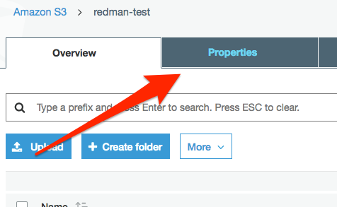
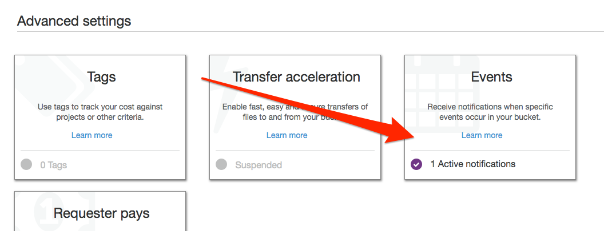
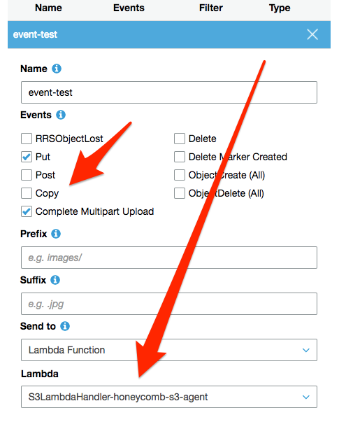

# Honeycomb Serverless Agent

This is a BETA - there may still be some bugs, and behavior may change in the future. We're also working to refine the installation process to get you going even faster!

## Current Features

- Generic JSON agent for Cloudwatch Logs
- VPC Flow Log agent for Cloudwatch Logs
- Generic JSON agent for S3 Logs

## Installation

### Generic JSON agent for Cloudwatch

#### Using the Cloudformation UI (the easiest way)

[Click here](https://console.aws.amazon.com/cloudformation/home?region=us-east-1#/stacks/new?stackName=honeycomb-cloudwatch-agent&templateURL=https://s3.amazonaws.com/honeycomb-builds/honeycombio/serverless-agent/LATEST/templates/cloudwatch-logs-json.yml) to launch the AWS Cloudformation Console to create the Serverless Agent stack. You will need one stack per Cloudwatch Log Group. The agent is configured using Cloudformation parameters, and for this template you will need to supply the following parameters:

- Stack Name
- Cloudwatch Log Group Name
- Your honeycomb write key (optionally encrypted)
- Target honeycomb dataset

Optional inputs include:

- Sample rate
- The ID of the AWS Key Management Service key used to encrypt your write key. If your write key is not encrypted, do not set a value here

#### Using the AWS CLI

If you need to turn up several stacks, or just don't like the Cloudformation UI, use the [AWS CLI](https://aws.amazon.com/cli/) and the script below. You'll also find this script under `examples/deploy-generic-json.sh`. You'll need to update values for `STACK_NAME`, `LOG_GROUP_NAME`, `HONEYCOMB_WRITE_KEY`, `KMS_KEY_ID`.

```bash
#!/bin/bash
ENVIRONMENT=production
STACK_NAME=CHANGEME
# change this to the log group name used by your application
LOG_GROUP_NAME=/change/me
# this is the base64-encoded KMS encrypted CiphertextBlob containing your write key
# To encrypt your key, run `aws kms encrypt --key-id $MY_KMS_KEY_ID --plaintext "$MY_HONEYCOMB_KEY"`
# paste the CyphertextBlob here
HONEYCOMB_WRITE_KEY=changeme
# this is the KMS Key ID used to encrypt the write key above
# try running `aws kms list-keys` - you want the UID after ":key/" in the ARN
KMS_KEY_ID=changeme
DATASET="cloudwatch-logs"
HONEYCOMB_SAMPLE_RATE="1"
TEMPLATE="file://./templates/cloudwatch-logs-json.yml"

JSON=$(cat << END
{
    "StackName": "${STACK_NAME}",
    "Parameters": [
        {
            "ParameterKey": "Environment",
            "ParameterValue": "${ENVIRONMENT}"
        },
        {
            "ParameterKey": "HoneycombWriteKey",
            "ParameterValue": "${HONEYCOMB_WRITE_KEY}"
        },
        {
            "ParameterKey": "KMSKeyId",
            "ParameterValue": "${KMS_KEY_ID}"
        },
        {
            "ParameterKey": "HoneycombDataset",
            "ParameterValue": "${DATASET}"
        },
        {
            "ParameterKey": "HoneycombSampleRate",
            "ParameterValue": "${HONEYCOMB_SAMPLE_RATE}"
        },
        {
            "ParameterKey": "LogGroupName",
            "ParameterValue": "${LOG_GROUP_NAME}"
        },
        {
            "ParameterKey": "TimeFieldName",
            "ParameterValue": ""
        },
        {
            "ParameterKey": "TimeFieldFormat",
            "ParameterValue": ""
        }
    ],
    "Capabilities": [
        "CAPABILITY_IAM"
    ],
    "OnFailure": "ROLLBACK",
    "Tags": [
        {
            "Key": "Environment",
            "Value": "${ENVIRONMENT}"
        }
    ]
}
END
)

aws cloudformation create-stack --cli-input-json "${JSON}" --template-body=${TEMPLATE}
```

If successful, you should see an output like this:

```json
{
    "StackId": "arn:aws:cloudformation:us-east-1:12345678910:stack/my-stack-name/19b46840-4348-11e8-9090-500c28b4e461"
}
```

### Generic JSON agent for S3

[Click here](https://console.aws.amazon.com/cloudformation/home?region=us-east-1#/stacks/new?stackName=honeycomb-s3-agent&templateURL=https://s3.amazonaws.com/honeycomb-builds/honeycombio/serverless-agent/LATEST/templates/s3-logs-json.yml) to launch the AWS Cloudformation Console to create the Serverless Agent stack. You will need one stack per S3 bucket that you want to subscribe to. The agent is configured using Cloudformation parameters, and for this template you will need to supply the following parameters:

- Stack Name
- Cloudwatch Log Group Name
- Your honeycomb write key (optionally encrypted)
- Target honeycomb dataset

Optional inputs include:

- Sample rate
- The ID of the AWS Key Management Service key used to encrypt your write key. If your write key is not encrypted, do not set a value here

#### Sending S3 events to Lambda

After your stack is created, you will need to manually configure your bucket to send PutObject and Upload events to Lambda.

From the AWS console, select the bucket that you want to subscribe to and select __Properties__:



Find __Advanced Settings__ and click __Events__:



Enable events __Put__ and __Complete Multipart Upload__ and select the lambda belonging to the honeycomb s3 agent. If you have multiple agents, remember to select the agent belonging to the stack that has permissions to access your bucket. You can optionally set a prefix and suffix, if you only want a subset of objects to be processed by your lambda. This is recommended if the bucket has multiple uses.



## How it works

### Cloudwatch

The Cloudformation template creates the following resources:

- An AWS Lambda Function
- An IAM role and policy used by the Lambda function. This role grants the Lambda function the ability to write to Cloudwatch (for its own logging) and to decrypt your write key using the provided KMS key (if applicable)
- A Lambda Permission granting Cloudwatch the ability to invoke this function
- A Cloudwatch Subscription Filter, which invokes this function when new Cloudwatch log events are received

### S3

The Cloudformation template creates the following resources:

- An AWS Lambda Function
- An IAM role and policy used by the Lambda function. This role grants the Lambda function the ability to write to Cloudwatch (for its own logging), retrieve objects from the specified bucket, and decrypt your write key using the provided KMS key (if applicable).
- A Lambda Permission granting S3 the ability to invoke this function

When an object is uploaded to your bucket, an S3 event object is passed to the lambda function. The lambda function invokes `S3:GetObject` on the object, retrieves its contents, and parses them line by line.

#### CAVEATS

Lambda's execution time is capped at 5 minutes. If you upload sufficiently large logs (in the 100s of megabytes or more), the function may not process all events before Lambda times out. It's best to submit your logs in smaller chunks - Lambda can scale to process more logs better than it can scale to process larger logs.

Increasing the MemorySize of the Lambda also increases its CPU allocation. If you are unable to break up your logs into smaller objects, and you find that the logs aren't being processed in the allowed 5 minutes, increasing MemorySize can lead to faster processing of events.

## Encrypting your Write Key

When creating an agent, you must supply your honeycomb write key via Cloudformation parameter. Cloudformation parameters are not encrypted, and are plainly viewable to anyone with access to your Cloudformation stacks. For this reason, we strongly recommend that your Honeycomb write key be encrypted. To encrypt your key, use AWS's KMS service.

First, you'll need to create a KMS key if you don't have one already. The default account keys are not suitable for this use case.

```
$ aws kms create-key --description "used to encrypt secrets"
{
    "KeyMetadata": {
        "AWSAccountId": "123455678910",
        "KeyId": "a38f80cc-19b5-486a-a163-a4502b7a52cc",
        "Arn": "arn:aws:kms:us-east-1:123455678910:key/a38f80cc-19b5-486a-a163-a4502b7a52cc",
        "CreationDate": 1524160520.097,
        "Enabled": true,
        "Description": "used to encrypt honeycomb secrets",
        "KeyUsage": "ENCRYPT_DECRYPT",
        "KeyState": "Enabled",
        "Origin": "AWS_KMS",
        "KeyManager": "CUSTOMER"
    }
}
$ aws kms create-alias --alias-name alias/secrets_key --target-key-id=a38f80cc-19b5-486a-a163-a4502b7a52cc
```

Now you're ready to encrypt your Honeycomb write key:

```
$ aws kms encrypt --key-id=a38f80cc-19b5-486a-a163-a4502b7a52cc --plaintext "thisismyhoneycombkey"
{
    "CiphertextBlob": "AQICAHge4+BhZ1sURk1UGUjTZxmcegPXyRqG8NCK8/schk381gGToGRb8n3PCjITQPDKjxuJAAAAcjBwBgkqhkiG9w0BBwagYzBhAgEAMFwGCSqGSIb3DQEHATAeBglghkgBZQMEAS4wEQQM0GLK36ChLOlHQiiiAgEQgC9lYlR3qvsQEhgILHhT0eD4atgdB7UAMW6TIAJw9vYsPpnbHhqhO7V8/mEa9Iej+g==",
    "KeyId": "arn:aws:kms:us-east-1:702835727665:key/a38f80cc-19b5-486a-a163-a4502b7a52cc"
}
```

Record the `CiphertextBlob` and the Key ID - this is what you'll pass to the Cloudformation templates.
